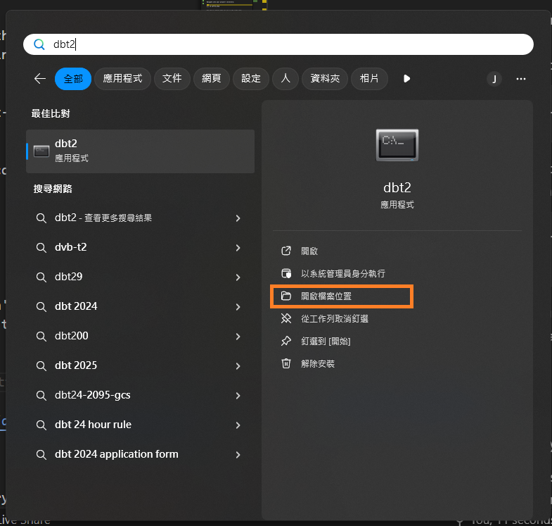

# `dbt-core` Quickstart

[](https://docs.getdbt.com/dbt-cli/cli-overview)
[](https://www.postgresql.org/)
[](https://www.python.org/)
[](https://www.docker.com/)

This is a `dbt-core` quickstart template, that supports PostgreSQL run with podman.
  
  This `dbt-core` quickstart taken from the various [dbt Developer Hub](https://docs.getdbt.com/guides) and [dbt courses](https://courses.getdbt.com/collections), using `PostgreSQL` as the data warehouse. There you are going to find the following  course:

- [dbt quickstart](https://docs.getdbt.com/docs/get-started-dbt)

In this tutorial, for the purpose of `dbt-core` exercises, I made some modifications to the `profiles.yml` file to use the local `PostgreSQL` repository.


- [`dbt-core` Quickstart](#dbt-core-quickstart)
- [Steps](#steps)
  - [1 Introduction​](#1-introduction)
  - [2 Create a repository and env prepare​](#2-create-a-repository-and-env-prepare)
  - [3 Create a project​](#3-create-a-project)
  - [4 Connect to PostgreSQL​](#4-connect-to-postgresql)
  - [5 Perform your first dbt run​](#5-perform-your-first-dbt-run)
  - [6 Commit your changes​](#6-commit-your-changes)
  - [7 Checkout a new git branch​](#7-checkout-a-new-git-branch)
  - [8 Build your first model​](#8-build-your-first-model)
  - [9 Change the way your model is materialized​](#9-change-the-way-your-model-is-materialized)
  - [10 Delete the example models​](#10-delete-the-example-models)
  - [11 Build models on top of other models​](#11-build-models-on-top-of-other-models)
  - [12 Add tests to your models​](#12-add-tests-to-your-models)
  - [13 Document your models​](#13-document-your-models)
  - [14 Commit updated changes​](#14-commit-updated-changes)
  - [15 Schedule a job​](#15-schedule-a-job)
  - [16 Supplemental Install](#16-supplemental-install)

# Steps

## [1 Introduction​](https://docs.getdbt.com/guides/manual-install?step=1)

This template will develop and run dbt commands using the dbt Cloud CLI — a dbt Cloud powered command line with PostgreSQL.

- Prerequisites
  - Python/conda
  - Podman desktop
  - DBeaver
  - git client
  - visual code
  
  - ***Windows***: Path review for conda if VSCode have python runtime issue. Following path needs add and move to higher priority.

  ```
  C:\ProgramData\anaconda3\Scripts
  C:\ProgramData\anaconda3
  ```
  
- Create a GitHub account if you don't already have one.


## [2 Create a repository and env prepare​](https://docs.getdbt.com/guides/manual-install?step=2)

1. Create a new GitHub repository

- Find our Github template repository [dbt-core-quickstart-template](https://github.com/saastoolset/dbt-core-quickstart-template)
- Click the big green 'Use this template' button and 'Create a new repository'.
- Create a new GitHub repository named **dbt-core-qs-ex1**.


2. Select Public so the repository can be shared with others. You can always make it private later.
2. Leave the default values for all other settings.
3. Click Create repository.
4. Save the commands from "…or create a new repository on the command line" to use later in Commit your changes.
5. Install and setup envrionment

- Create python virtual env for dbt
  - For venv and and docker, using the [installation instructions](https://docs.getdbt.com/docs/core/installation-overview) for your operating system.
  - For conda in Windows, open conda prompt terminal in system administrador priviledge

    ```
    (base) C:> cd C:\Proj\CUB-EDW\50-GIT\dbt-core-qs-ex1\bin
    (base) C:> conda env create -n dbt 
    (base) C:> conda activate dbt
    ```
  - ***Windows***: create shortcut to taskbar
    - Find application shortcut location

    

    - Copy and rename shortcut to venv name
    - Change location parameter to venv name
    
    

    - Pin the shortcut to Start Menu

- Install dbt Core
  ```command
        (dbt) C:> conda install dbt-core dbt-postgres
  ```

- Start up db and pgadmin
  . use admin/Password as connection

  ```
  (dbt) C:> db-start-pg.bat
  ``` 


## [3 Create a project​](https://docs.getdbt.com/guides/manual-install?step=3)

Make sure you have dbt Core installed and check the version using the dbt --version command:

```
C:> dbt --version
```

- Init project in repository home directory
  Initiate the jaffle_shop project using the init command:

```python
C:> cd C:\Proj\CUB-EDW\50-GIT\dbt-core-qs-ex1
C:> dbt init jaffle_shop
```

Navigate into your project's directory:

```command
C:> cd jaffle_shop
```

Use pwd to confirm that you are in the right spot:

```command
C:>  cd

(dbt) C:\Proj\CUB-EDW\50-GIT\dbt-core-qs-ex1\jaffle_shop>
```

Use a code editor VSCode to open the project directory

```command
(dbt) C:\Proj\CUB-EDW\50-GIT\dbt-core-qs-ex1\jaffle_shop> code .
```

## [4 Connect to PostgreSQL​](https://docs.getdbt.com/guides/manual-install?step=4)


- Update `profiles.yml`
Now we should create the `profiles.yml` file on the `C:\Users\YourID\.dbt` directory. The file should look like this:

```YAML
jaffle_shop:
  outputs:
    dev:
      dbname: postgres
      host: localhost
      user: admin      
      pass: Passw0rd 
      port: 5432
      schema: dbt
      threads: 1
      type: postgres
  target: dev
```

- Test connection config

```
C:> cd jaffle_shop
C:> dbt debug
``` 

- Load sample data
 We should copy this data from the `db/seeds` directory.


  - Edit `dbt_project.yml`
  Now we should create the `dbt_project.yml` file on the `jaffle_shop` directory. Append following config:

  ```YAML
  seeds:
    jaffle_shop:
      +schema: jaffle_shop
  ```


  - copy seeds data
  ```
  C:> copy ..\db\seeds\*.csv seeds
  C:> dbt seeds
  ```

- Verfiy result in database client
This command will spin and will create the `dbt_jaffle_shop` schema, and create and insert the `.csv` files to the following tables:

  - `dbt_jaffle_shop.customers`
  - `dbt_jaffle_shop.orders`
  - `dbt_jaffle_shop.payments`


## [5 Perform your first dbt run​](https://docs.getdbt.com/guides/manual-install?step=5)

Perform your first dbt run
Our sample project has some example models in it. We're going to check that we can run them to confirm everything is in order.

Enter the run command to build example models:

```
dbt run
```

## [6 Commit your changes​](https://docs.getdbt.com/guides/manual-install?step=6)

Commit your changes so that the repository contains the latest code.

Link the GitHub repository you created to your dbt project by running the following commands in Terminal. Make sure you use the correct git URL for your repository, which you should have saved from step 5 in Create a repository.

- Use git client tool
or
- Use git command line
  
```
git init
git branch -M main
git add .
git commit -m "Create a dbt project"
git remote add origin https://github.com/USERNAME/dbt-core-qs-ex1.git
git push -u origin main
```

Return to your GitHub repository to verify your new files have been added.

## [7 Checkout a new git branch​](https://docs.getdbt.com/guides/manual-install?step=7)

Check out a new git branch to work on new code:

Create a new branch by using the checkout command and passing the -b flag:

- Use git client tool
or
- Use git command line

```
$ git checkout -b add-customers-model
> Switched to a new branch `add-customer-model`
```

## [8 Build your first model​](https://docs.getdbt.com/guides/manual-install?step=8)

- Open your project in your favorite code editor.
- Create a new SQL file in the models directory, named models/customers.sql.
- Paste the following query into the models/customers.sql file.

```SQL
with customers as (

    select
        id as customer_id,
        first_name,
        last_name

    from dbt_jaffle_shop.customers

),

orders as (

    select
        id as order_id,
        user_id as customer_id,
        order_date,
        status

    from dbt_jaffle_shop.orders

),

customer_orders as (

    select
        customer_id,

        min(order_date) as first_order_date,
        max(order_date) as most_recent_order_date,
        count(order_id) as number_of_orders

    from orders

    group by 1

),

final as (

    select
        customers.customer_id,
        customers.first_name,
        customers.last_name,
        customer_orders.first_order_date,
        customer_orders.most_recent_order_date,
        coalesce(customer_orders.number_of_orders, 0) as number_of_orders

    from customers

    left join customer_orders using (customer_id)

)

select * from final
```

- From the command line, enter

```
dbt run
```

## [9 Change the way your model is materialized​](https://docs.getdbt.com/guides/manual-install?step=9)

By default, everything gets created as a view. You can override that at the directory level so everything in that directory will materialize to a different materialization.

- Edit your dbt_project.yml file.

  - Update your project name to:

 ```
    name: 'jaffle_shop'
 ```

- Configure jaffle_shop so everything in it will be materialized as a table; and configure example so everything in it will be materialized as a view. Update your models config block to:

```
models:
  jaffle_shop:
    +materialized: table
    example:
      +materialized: view
```

- Enter the dbt run command. Your customers model should now be built as a table!
  
- Edit models/customers.sql to override the dbt_project.yml for the customers model only by adding the following snippet to the top, and click Save:
  
```

{{
  config(
    materialized='view'
  )
}}

with customers as (

    select
        id as customer_id
        ...

)

```

- Enter the dbt run command. Your model, customers, should now build as a view.

## [10 Delete the example models​](https://docs.getdbt.com/guides/manual-install?step=10)

You can now delete the files that dbt created when you initialized the project:

- Delete the models/example/ directory.

- Delete the example: key from your dbt_project.yml file, and any configurations that are listed under it.
-

```
# before
models:
  jaffle_shop:
    +materialized: table
    example:
      +materialized: view
```

```
# after
models:
  jaffle_shop:
    +materialized: table
```

## [11 Build models on top of other models​](https://docs.getdbt.com/guides/manual-install?step=11)

Now you can experiment by separating the logic out into separate models and using the ref function to build models on top of other models:

- Create a new SQL file, models/stg_customers.sql, with the SQL from the customers CTE in our original query.
- Create a second new SQL file, models/stg_orders.sql, with the SQL from the orders CTE in our original query.

***models/stg_customers.sql***

```SQL
select
    id as customer_id,
    first_name,
    last_name

from dbt_jaffle_shop.customers
```
  
***models/stg_orders.sql***

```SQL
with customers as (

    select * from {{ ref('stg_customers') }}

),

orders as (

    select * from {{ ref('stg_orders') }}

),

customer_orders as (

    select
        customer_id,

        min(order_date) as first_order_date,
        max(order_date) as most_recent_order_date,
        count(order_id) as number_of_orders

    from orders

    group by 1

),

final as (

    select
        customers.customer_id,
        customers.first_name,
        customers.last_name,
        customer_orders.first_order_date,
        customer_orders.most_recent_order_date,
        coalesce(customer_orders.number_of_orders, 0) as number_of_orders

    from customers

    left join customer_orders using (customer_id)
)

select * from final
```

- Execute dbt run.

## [12 Add tests to your models​](https://docs.getdbt.com/guides/manual-install?step=12)

Adding tests to a project helps validate that your models are working correctly.

To add tests to your project:

- Create a new YAML file in the models directory, named models/schema.yml

- Add the following contents to the file:

***models/schema.yml***

```SQL
version: 2

models:
  - name: customers
    columns:
      - name: customer_id
        tests:
          - unique
          - not_null

  - name: stg_customers
    columns:
      - name: customer_id
        tests:
          - unique
          - not_null

  - name: stg_orders
    columns:
      - name: order_id
        tests:
          - unique
          - not_null
      - name: status
        tests:
          - accepted_values:
              values: ['placed', 'shipped', 'completed', 'return_pending', 'returned']
      - name: customer_id
        tests:
          - not_null
          - relationships:
              to: ref('stg_customers')
              field: customer_id
```

- Run dbt test, and confirm that all your tests passed.

## [13 Document your models​](https://docs.getdbt.com/guides/manual-install?step=13)

Adding documentation to your project allows you to describe your models in rich detail, and share that information with your team. Here, we're going to add some basic documentation to our project.

- Update your models/schema.yml file to include some descriptions, such as those below.
  
***models/schema.yml***

```YAML
version: 2

models:
  - name: customers
    description: One record per customer
    columns:
      - name: customer_id
        description: Primary key
        tests:
          - unique
          - not_null
      - name: first_order_date
        description: NULL when a customer has not yet placed an order.

  - name: stg_customers
    description: This model cleans up customer data
    columns:
      - name: customer_id
        description: Primary key
        tests:
          - unique
          - not_null

  - name: stg_orders
    description: This model cleans up order data
    columns:
      - name: order_id
        description: Primary key
        tests:
          - unique
          - not_null
      - name: status
        tests:
          - accepted_values:
              values: ['placed', 'shipped', 'completed', 'return_pending', 'returned']
      - name: customer_id
        tests:
          - not_null
          - relationships:
              to: ref('stg_customers')
              field: customer_id
```

- Run dbt docs generate to generate the documentation for your project. dbt introspects your project and your warehouse to generate a JSON file with rich documentation about your project.
- Run dbt docs serve command to launch the documentation in a local website.

## [14 Commit updated changes​](https://docs.getdbt.com/guides/manual-install?step=14)

- You need to commit the changes you made to the project so that the repository has your latest code.

- Add all your changes to git: git add -A
- Commit your changes: git commit -m "Add customers model, tests, docs"
- Push your changes to your repository: git push
Navigate to your repository, and open a pull request to merge the code into your master branch.

## [15 Schedule a job​](https://docs.getdbt.com/guides/manual-install?step=15)

- Instead of dbt-cloud, we will leverage airflow to schedule.
- [dbt airflow blog post](https://docs.getdbt.com/blog/dbt-airflow-spiritual-alignment)

## 16 Supplemental Install

- Visual Code Addon
  - dbt-osmosis
  - Power User for dbt
  
- Python package
  - dbt-loom
  