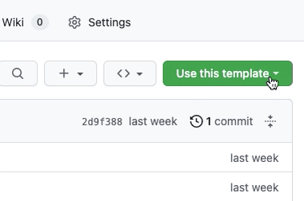

# dbt-core-quickstart
dbt-core quickstart template in PostgreSQL and podman 


# `dbt` Quickstart
[](https://docs.getdbt.com/dbt-cli/cli-overview)
[](https://www.postgresql.org/)
[](https://www.python.org/)
[](https://www.docker.com/)

`dbt` quickstart taken from the different [dbt Developer Hub](https://docs.getdbt.com/guides) and [dbt courses](https://courses.getdbt.com/collections), using `PostgreSQL` as the data warehouse. There you are going to find the following  course:

- [dbt quickstart](https://docs.getdbt.com/docs/get-started-dbt)

In this tutorial, for the purpose of dbt-core exercises, I made some modifications to the `profiles.yml` file to use the local `PostgreSQL` repository.

This is a template for creating a fully functional dbt project for teaching, learning, writing, demoing, or any other scenarios where you need a basic project with a synthesized jaffle shop business.

## How to use

### 1. Click the big green 'Use this template' button and 'Create a new repository'.




## Project Set Up

### Create DB


### Load sample data
 We should download this data on the `db/seeds` directory.

Now we can create the PostgreSQL database an insert the dowbloaded data to get along with the tutorial. To do so, just change directory to `db` and execute:
```
$ dbt seeds
```
This command will spin a PostgreSQL database on localhost and port 5432, and will create the `raw` database, and create and insert the `.csv` files to the following tables:
- `jaffle_shop.customers`
- `jaffle_shop.orders`
- `stripe.payments`


### dbt install
Once the database is ready, we can install `dbt` and initiate the `dbt` project:
```
$ pip3 install dbt-postgres
$ dbt init jaffle_shop
```

Now we should create the `profiles.yml` file on the `jaffle_shop` directory. The file should look like this:
```
config:
    use_colors: True 
jaffle_shop:
  outputs:
    dev:
      type: postgres
      threads: 1
      host: localhost
      port: 5432
      user: "docker"
      pass: "docker"
      dbname: raw
      schema: dev
    prod:
      type: postgres
      threads: 1
      host: localhost
      port: 5432
      user: "docker"
      pass: "docker"
      dbname: raw
      schema: analytics
  target: dev
```

To run `dbt`, we just execute, inside `jaffle_shop` directory
```
$ dbt run --profiles-dir .
```
This will run all the modles defined on the `models` directory.

In case you only want to run 1 model, you can execute
```
$ dbt run -m FILE_NAME --profiles-dir .
```

In case you only want to run 1 model and all the other ones that depends on it, you can execute
```
$ dbt run -m FILE_NAME+ --profiles-dir .
```

In case you only want to run 1 model and all the previous ones, you can execute
```
$ dbt run -m +FILE_NAME --profiles-dir .
```

In case you only want to run 1 model, all the previous ones and all the dependencies, you can execute
```
$ dbt run -m +FILE_NAME+ --profiles-dir .
```

To compile the queries, we can run:
```
$ dbt compile --profiles--dir .
```
That command will save the compiled queries on `target/compiled/PROJECT_NAME/models` directory
